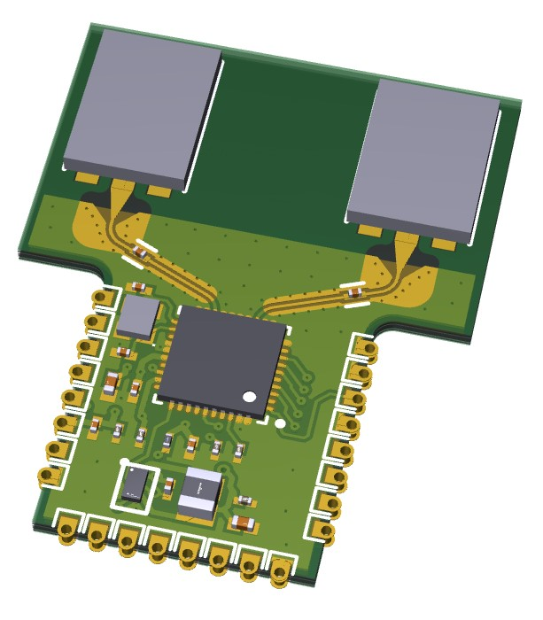
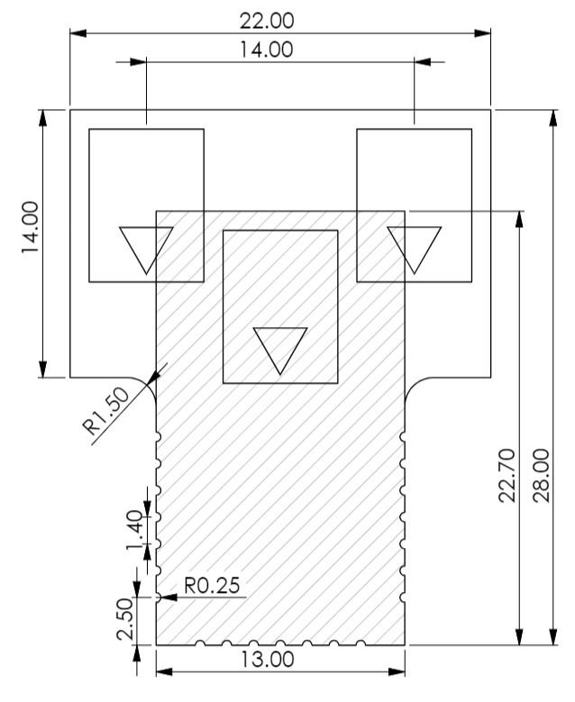
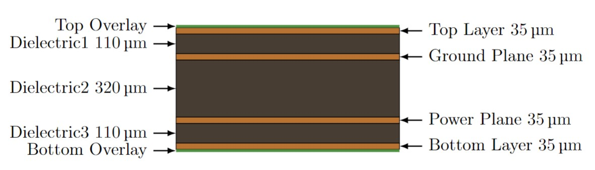

<!--
*** Template source: https://github.com/othneildrew/Best-README-Template/blob/master/README.md
-->

<!-- PROJECT SHIELDS -->
<!--
*** I'm using markdown "reference style" links for readability.
*** Reference links are enclosed in brackets [ ] instead of parentheses ( ).
*** See the bottom of this document for the declaration of the reference variables
*** for contributors-url, forks-url, etc. This is an optional, concise syntax you may use.
*** https://www.markdownguide.org/basic-syntax/#reference-style-links
-->
[![Contributors][contributors-shield]][contributors-url]
[![Forks][forks-shield]][forks-url]
[![Stargazers][stars-shield]][stars-url]
[![Issues][issues-shield]][issues-url]
[![License][license-shield]][license-url]

# T-Module: a Miniaturized UWB AoA Module
> Note: This repository is currently under construction

## About The Module
The T-Module is a miniaturized UWB module capable of AoA incorporating the DW3220 transceiver and two UWB chip antennas. Thanks to the pin compatibility with the [DWM3000](https://www.qorvo.com/products/p/DWM3000) by 
Qorvo it can be used for existing projects. Information about the functionality of the pins and the footprint can be found in the DWM3000 Datasheet.

### Size
To have enough space for the two antennas the top part of the T-Module is a bit wider than the bottom, giving this T-shape look. The figure below is the shape and placement of the chip antennas of the T-Module overlayed by the DWM3000(hatched).

### Stack Up
For the stack-up depicted below an FR-4 Tg150 dielectric was used.

[contributors-shield]: https://img.shields.io/github/contributors/ETH-PBL/UWB_DualAntenna_AoA.svg?style=flat-square
[contributors-url]: https://github.com/ETH-PBL/UWB_DualAntenna_AoA/graphs/contributors
[forks-shield]: https://img.shields.io/github/forks/ETH-PBL/UWB_DualAntenna_AoA.svg?style=flat-square
[forks-url]: https://github.com/ETH-PBL/UWB_DualAntenna_AoA/network/members
[stars-shield]: https://img.shields.io/github/stars/ETH-PBL/UWB_DualAntenna_AoA.svg?style=flat-square
[stars-url]: https://github.com/ETH-PBL/UWB_DualAntenna_AoA/stargazers
[issues-shield]: https://img.shields.io/github/issues/ETH-PBL/UWB_DualAntenna_AoA.svg?style=flat-square
[issues-url]: https://github.com/ETH-PBL/UWB_DualAntenna_AoA/issues
[license-shield]: https://img.shields.io/github/license/ETH-PBL/UWB_DualAntenna_AoA.svg?style=flat-square
[license-url]: https://github.com/ETH-PBL/UWB_DualAntenna_AoA/blob/master/LICENSE
