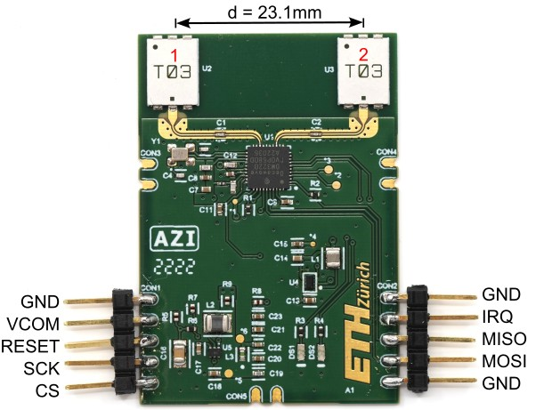

<!--
*** Template source: https://github.com/othneildrew/Best-README-Template/blob/master/README.md
-->

<!-- PROJECT SHIELDS -->
<!--
*** I'm using markdown "reference style" links for readability.
*** Reference links are enclosed in brackets [ ] instead of parentheses ( ).
*** See the bottom of this document for the declaration of the reference variables
*** for contributors-url, forks-url, etc. This is an optional, concise syntax you may use.
*** https://www.markdownguide.org/basic-syntax/#reference-style-links
-->
[![Contributors][contributors-shield]][contributors-url]
[![Forks][forks-shield]][forks-url]
[![Stargazers][stars-shield]][stars-url]
[![Issues][issues-shield]][issues-url]
[![License][license-shield]][license-url]


# Angle of Arrival and Centimeter Distance Estimation with a miniaturized UWB Module

This repository contains the hardware of an UWB-AoA shield using the Qorvo DW3220 and presented in ***Angle of arrival and centimeter distance estimation on a smart UWB sensor node***. 
Additionally the repository contains firmware to use the module with an STM32 and dataset as presented in the publication. An in-depth analysis of  the hardware and the proposed algorithms for error compensation and angle estimation can be found here: 
[IEEE TIM](https://doi.org/10.1109/TIM.2023.3282289) / [arXiv:2312.13672 (preprint)](https://doi.org/10.48550/arXiv.2312.13672)

> <div align="justify">Accurate and low-power indoor localization is becoming more and more of a necessity to empower novel consumer and industrial applications. In this field, the most promising technology is based on UWB modulation; however, current UWB positioning systems do not reach centimeter accuracy in general deployments due to multipath and nonisotropic antennas, still necessitating several fixed anchors to estimate an object's position in space. This article presents an in-depth study and assessment of angle of arrival (AoA) UWB measurements using a compact, low-power solution integrating a novel commercial module with phase difference of arrival (PDoA) estimation as integrated feature. Results demonstrate the possibility of reaching centimeter distance precision and 2.4° average angular accuracy in many operative conditions, e.g., in a 90° range around the center. Moreover, integrating the channel impulse response, the phase differential of arrival, and the point-to-point distance, an error correction model is discussed to compensate for reflections, multipaths, and front-back ambiguity.</div>

If you use **Angle of Arrival and Centimeter Distance Estimation with a miniaturized UWB Module** in an academic or industrial context, please cite the following publications:

```bibtex
@article{margiani2023angle,
  title={Angle of arrival and centimeter distance estimation on a smart UWB sensor node},
  author={Margiani, Tobias and Cortesi, Silvano and Keller, Milena and Vogt, Christian and Polonelli, Tommaso and Magno, Michele},
  journal={IEEE Transactions on Instrumentation and Measurement},
  doi={https://doi.org/10.1109/TIM.2023.3282289},
  year={2023},
  publisher={IEEE}
}
```

```bibtex
@inproceedings{polonelli2022performance,
  title={Performance Comparison between Decawave DW1000 and DW3000 in low-power double side ranging applications},
  author={Polonelli, Tommaso and Schl{\"a}pfer, Simon and Magno, Michele},
  booktitle={2022 IEEE Sensors Applications Symposium (SAS)},
  doi={https://doi.org/10.1109/SAS54819.2022.9881375},
  pages={1--6},
  year={2022},
  organization={IEEE}
}
```
## Folder structure

The hardware design files are located in [Hardware](Hardware).

The published data is available in the [Dataset](Dataset) subfolder.

The firmware used for the double antenna and single antenna modules is
available in the [Firmware](Firmware) subfolder.

Each folder contains a `README.md` containing more information.

### Hardware - UWB Modules



We release two modules,
- [T_Module](Hardware/T_module) (22x28 mm) optimized for production cost and dimensions
- [UWB_AoA_module](Hardware/UWB_AoA_module) (30x45 mm) optimized for performances and R&D
   Used for the scientific publication "Angle of arrival and centimeter distance estimation on a smart UWB sensor node"

### Firmware

The firmware consists of basic applications using the Qorvo SDK on an STM32. The created applications read PDoA and CIR values from the UWB module, and transmit them to the computer using UART.

### Dataset

The data contains records from more than 19000 Two Way Ranging (TWR) exchanges
and is collected at the double antenna module. Raw data containing
measurements from each received UWB frame as well as preprocessed data with a
subset of fields from TWR result frames is provided.

### Scripts

The double antenna UWB module sends measurement data over the serial connection for processing. The scripts in this directory help to save and preprocess that data for analysis.


[contributors-shield]: https://img.shields.io/github/contributors/ETH-PBL/UWB_DualAntenna_AoA.svg?style=flat-square
[contributors-url]: https://github.com/ETH-PBL/UWB_DualAntenna_AoA/graphs/contributors
[forks-shield]: https://img.shields.io/github/forks/ETH-PBL/UWB_DualAntenna_AoA.svg?style=flat-square
[forks-url]: https://github.com/ETH-PBL/UWB_DualAntenna_AoA/network/members
[stars-shield]: https://img.shields.io/github/stars/ETH-PBL/UWB_DualAntenna_AoA.svg?style=flat-square
[stars-url]: https://github.com/ETH-PBL/UWB_DualAntenna_AoA/stargazers
[issues-shield]: https://img.shields.io/github/issues/ETH-PBL/UWB_DualAntenna_AoA.svg?style=flat-square
[issues-url]: https://github.com/ETH-PBL/UWB_DualAntenna_AoA/issues
[license-shield]: https://img.shields.io/github/license/ETH-PBL/UWB_DualAntenna_AoA.svg?style=flat-square
[license-url]: https://github.com/ETH-PBL/UWB_DualAntenna_AoA/blob/master/LICENSE

